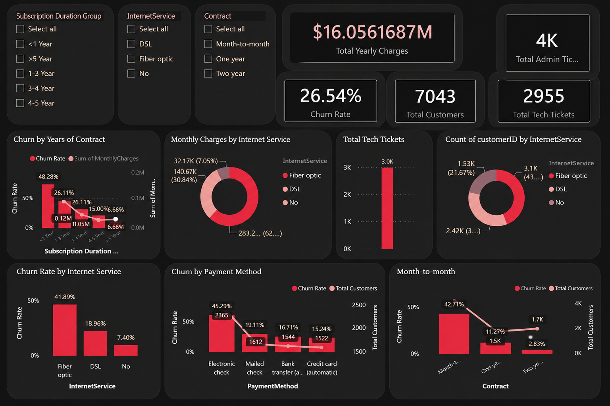
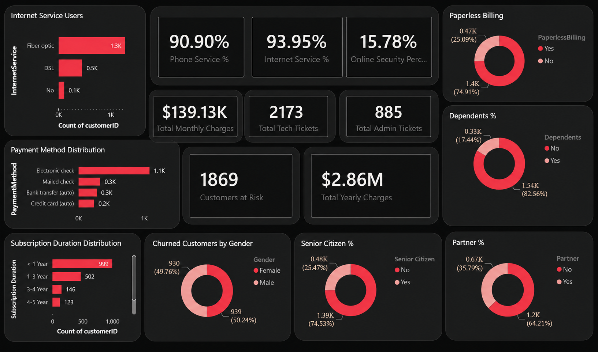

# Customer Churn & Risk Analysis Dashboard

## Project Overview

This project analyzes customer churn and risk factors using Microsoft Power BI.

The dashboard provides an interactive view of customer behavior, churn rate, customer risk, service usage, financial metrics, and support ticket activity.

## Tools & Skills

- Microsoft Power BI
- Power Query
- DAX
- Data Cleaning
- Data Analysis
- Data Visualization
- KPI Development
- Interactive Dashboards

## Dashboard Pages

### 1. Customer Risk Analysis

This page provides an overview of customer risk and key business performance indicators.

Key metrics include:

- Total Customers
- Churn Rate
- Total Yearly Charges
- Admin Tickets
- Tech Tickets

### 2. Customer Churn

This page focuses on churned customers and analyzes their characteristics and related business metrics.

Key metrics include:

- Customers at Risk
- Tech Tickets
- Admin Tickets
- Monthly Charges
- Yearly Charges

## Key Analysis Areas

- Customer churn rate
- Customer risk analysis
- Internet service usage
- Contract types
- Payment methods
- Subscription duration
- Customer support tickets
- Monthly and yearly charges
- Customer demographics

## Data Analysis & KPIs

The dashboard uses Power BI measures to analyze key customer and business metrics, including:

- Total Customers
- Customers at Risk
- Churn Rate
- Total Monthly Charges
- Total Yearly Charges
- Total Admin Tickets
- Total Tech Tickets

## Project Purpose

The purpose of this project was to practice a complete Power BI data analysis workflow, including data preparation, KPI development, interactive dashboard design, and customer churn analysis.

## Project Files

- `Customer_Churn_Dashboard.pbix` — Power BI report file
- `screenshots/customer-risk-analysis.png` — Customer Risk Analysis dashboard
- `screenshots/customer-churn.png` — Customer Churn dashboard
